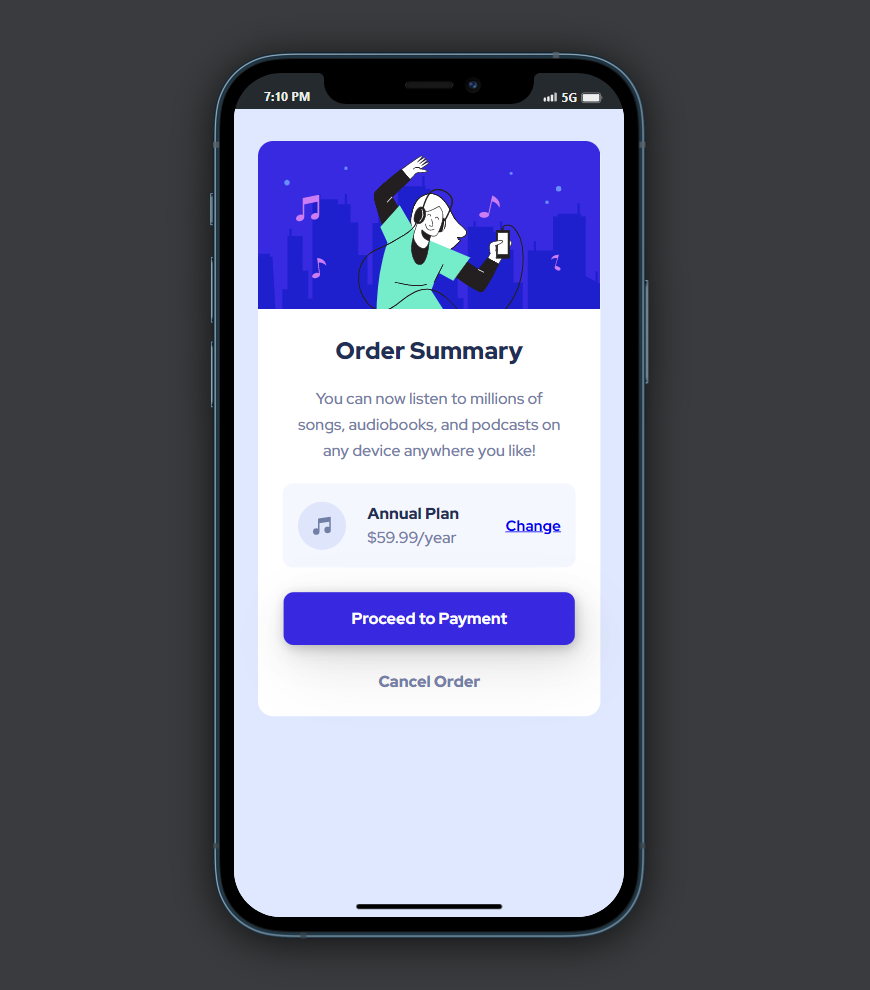

# Order summary card solution

This is a solution to the [Order summary card challenge on Frontend Mentor](https://www.frontendmentor.io/challenges/order-summary-component-QlPmajDUj).

## Table of contents

- [Overview](#overview)
  - [Screenshot](#screenshot)
  - [Links](#links)
- [My process](#my-process)
  - [Built with](#built-with)
  - [Useful resources](#useful-resources)
- [Author](#author)

## Overview

This is a solution to the Order summary card challenge on Frontend Mentor. The challenge was to build order summary card component and get it looking as close to the design as possible. And users should be able to view the optimal layout for the site depending on their device's screen size and see hover states for interactive elements.

### Screenshot

Desktop Preview

Mobile Preview

### Links

- Solution URL: [Solution](https://github.com/Himanshupegu/Order-summary-component)
- Live Site URL: [Live site](https://himanshupegu.github.io/Order-summary-component/)

## My process

### Built with

- Semantic HTML5 markup
- CSS custom properties
- Scss
- Flexbox
- Mobile-first workflow

### Useful resources

- [Shadows.brumn.af](https://shadows.brumm.af/) - This helped me creating the shadows for the payment button.

## Author

- Frontend Mentor - [@Himanshupegu](https://www.frontendmentor.io/profile/Himanshupegu)
